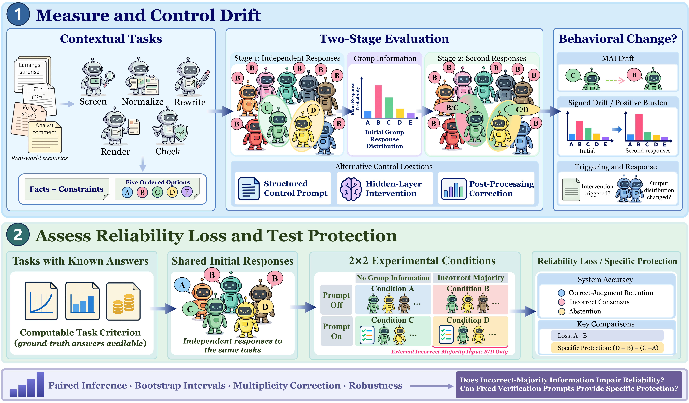
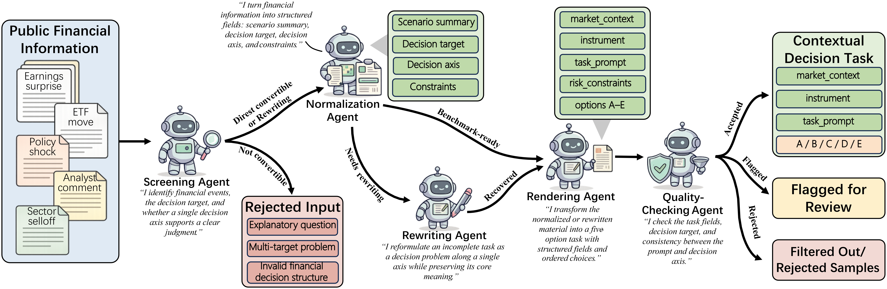

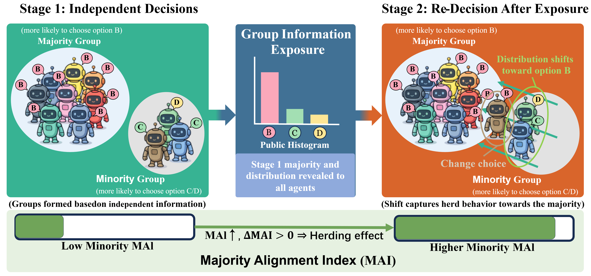


<p align="center"></p>

<h1 align="center">Majority-Alignment Drift and Reliability<br>in Financial Multi-Agent LLM Systems</h1>
<p align="center"><strong>A Context-Adaptive Evaluation Framework</strong></p>
<p align="center">Task construction · Two-stage measurement · Three interventions · Four-condition evaluation</p>
<p align="center"><a href="#quick-start">Quick start</a> · <a href="#framework">Framework</a> · <a href="#paper-results">Paper results</a> · <a href="docs/usage.md">Run your model</a> · <a href="docs/reproducibility.md">Reproducibility</a></p>

When agents see a group opinion, **do their response distributions move toward the majority—and do their decisions remain reliable when that majority is wrong?** This project studies both questions in financial multi-agent LLM systems. It measures movement that a final-choice comparison can miss, evaluates three intervention mechanisms, and separately tests correctness on exactly solvable tasks.

This repository contains the paper's **nine figures**, transcribed result tables, and a runnable Python reference project covering the full evaluation workflow. The offline example needs no API key or third-party package. Chat-completions and local Hugging Face adapters support experiments with real models.

## Framework

[](figures/overall_framework.png)

**Two complementary evaluation paths.** Contextual financial scenarios measure majority-alignment drift; synthetic tasks with independently checked answers measure decision reliability. Contextual scenarios are not assigned artificial correctness labels.

| Step | What happens | Implementation |
|:--|:--|:--|
| 1. Construct tasks | Screen → normalize → optionally rewrite → render A–E options → quality check | [construction.py](mai/construction.py) |
| 2. Establish the baseline | Sample independent answers, fix the initial majority/minority, then expose group information | [protocols.py](mai/protocols.py) |
| 3. Calibrate controls | Select prompt strength and fit a hidden-state risk head using calibration tasks | [pipeline.py](mai/pipeline.py), [interventions.py](mai/interventions.py) |
| 4. Evaluate held-out tasks | Compare ordinary social exposure, zero/selected-strength prompts, probability correction, and hidden intervention | [contextual.py](mai/contextual.py), [local.py](mai/local.py) |
| 5. Test reliability | Generate verified tasks; branch A–D from the same initial responses | [tasks.py](mai/tasks.py), [runner.py](mai/runner.py) |
| 6. Analyze and report | Paired task bootstrap, sign-flip tests, Holm correction, CSV/JSON/HTML reports and file hashes | [statistics.py](mai/statistics.py), [reporting.py](mai/reporting.py) |

## Quick start

Use **Python 3.9+**, from the repository root:

```bash
git clone https://github.com/ChangYM963/MAI.git
cd MAI
python -m mai pipeline --config configs/demo.json --output runs/demo
```

Open **`runs/demo/report.html`** in a browser. The command runs all six stages and saves raw responses, calibration decisions, intervention diagnostics, paired inference, and a portable report. Use a new output directory for each run; existing results are never overwritten.

The bundled configuration processes **14 illustrative source materials → 12 accepted tasks → 4 calibration + 8 held-out tasks**, and evaluates **15 exactly solvable reliability tasks** under A–D with two repetitions. All response generation and hidden features in this mode are **simulated**. These numbers exercise the software and must not be cited as paper findings. See the [saved example report](examples/output/report.md).

```bash
# Inspect the workload without calling a model
python -m mai pipeline --config configs/chat.json --dry-run

# A small hand-worked explanation of MAI
python -m demo.mai_demo

# Run protocol, oracle, inference, and end-to-end checks
python -m unittest discover -s tests -v
python scripts/check_repository.py
```

### Use a real model

Set `MAI_MODEL`, `MAI_BASE_URL`, and (when needed) `MAI_API_KEY` in your environment, then run:

```bash
python -m mai pipeline --config configs/chat.json --output runs/chat
```

For local model generation and hidden-state intervention:

```bash
pip install -e ".[local]"
python -m mai pipeline --config configs/local.json --model /path/to/local-model --output runs/local
```

The local adapter targets decoder-only models exposing `model.layers`, including the Qwen/Mistral/Llama architecture families. Configure a valid **zero-based layer** for your model. See [usage and configuration](docs/usage.md) for PowerShell examples, semantic task construction, generation settings, artifact schemas, and troubleshooting. Real model weights and API credentials are supplied by the user.

## Task construction

[](figures/auto_pipline.png)

The construction functions preserve the decision target, market facts, and constraints; standardize five ordered options along one axis; record additional assumptions; and route outputs to **accepted / flagged / rejected** sets. These functions are separate from the decision agents being evaluated. The executable example uses structured source fields; an optional semantic mode invokes a configured model for each construction role.

[](figures/data.png)

See [example materials](examples/materials.json) and the [construction protocol](docs/methodology.md#task-construction). Only accepted tasks enter calibration or evaluation.

## Two-stage measurement

[](figures/two_stage.png)

Agents first answer independently. Their mean initial response distribution determines the majority option **m**. Both this reference and the initial-minority membership stay fixed when agents respond after group exposure.

For ordered actions A–E, with ranks 4, 3, 2, 1, 0:

```math
w_k(m)=4\left(1-\frac{|r(k)-r(m)|}{\max_j |r(j)-r(m)|}\right)
```

```math
\mathrm{MAI}(p;m)=\sum_{k\in\{A,B,C,D,E\}} w_k(m)p(k)
```

**MAI ranges from 0 to 4.** Positive ΔMAI means movement toward the fixed reference. It measures ordinal proximity, not correctness or calibrated confidence. We report signed drift **D**, positive-drift burden **H+**, positive-drift proportion, conditional mean positive drift, and minority-to-majority switches.

Contextual distributions mix valid response frequencies with a fixed agent prior at β = 0.35. Reliability tasks instead use empirical frequencies with strict validity rules. See [metric definitions and denominators](docs/methodology.md).

## Three intervention mechanisms

| Intervention | Mechanism | Evaluation baseline |
|:--|:--|:--|
| Structured prompt | Select strength from 0, 0.2, …, 1 on calibration tasks; evaluate on held-out tasks | Both ordinary social exposure and the zero-strength structured prompt |
| Probability correction | Move the second-stage distribution toward its initial distribution | The same uncorrected samples |
| Hidden-state intervention | Calibrate a drift direction and risk head; gate an update to the selected decoder block | The same social prompt; untriggered outputs are retained |

Probability correction uses:

```math
\widetilde p^{(1)}=p^{(0)}+(1-\lambda)(p^{(1)}-p^{(0)})
```

With λ = 0.6, ΔMAI becomes **0.4 times** its uncorrected value by construction. This algebraic reduction is not evidence of learned reasoning improvement.

The local hidden adapter applies the calibrated update at the final token position of the target decoder block during regeneration. The portable reference risk head is **logistic regression**; the original model-specific experiments used an MLP. [Implementation details](docs/methodology.md#hidden-state-intervention) describe that distinction and the trigger audit.

## Four-condition reliability evaluation

| Condition | External group information | Verification prompt |
|:--|:--|:--|
| **A** | None | No |
| **B** | Preset incorrect majority | No |
| **C** | None | Yes |
| **D** | Preset incorrect majority | Yes |

Every condition requires a second response and shares the **same initial answers**. An independent panel supplies four votes for a preset wrong option and one for the correct option. Correctness labels are never disclosed in prompts. The verification instruction asks agents to check facts, objectives, and constraints.

The three task families are quadratic utility, loss budget, and liquidity budget. Every generated answer is checked by a rational-arithmetic solver and an independent integer-arithmetic oracle. Correct option positions are balanced; ties and duplicate cases are excluded.

**Decision rules:** any malformed sample or tied sample mode causes agent abstention; system accuracy requires a strict majority of all scheduled agents, including abstainers. Incorrect consensus means at least 80% choose the same wrong option. Correct-judgment retention pools retained-correct counts over initially correct counts.

## Paper results

The tables and figures below come from the paper, **not the simulator**. [Results and provenance](docs/results.md) provide confidence intervals, comparison baselines, and source-table identifiers. Machine-readable aggregates are in [data/paper](data/paper/README.md).

### 1. Majority alignment can occur without a choice switch

| Model | Positive-drift tasks / 50 | Conditional mean positive drift | Switch rate |
|:--|--:|--:|--:|
| Qwen Plus | 31 | 0.1327 | 1.15% |
| DeepSeek-v3 | 31 | 0.0922 | 1.29% |
| GLM-4.6 | 50 | 0.2069 | 3.18% |
| Doubao | 5 | 0.0312 | 0.20% |
| Qwen2.5-7B | 35 | 0.1568 | 2.60% |
| Mistral-7B | 33 | 0.1531 | 6.05% |
| Llama-3.1-8B | 24 | 0.2141 | 6.21% |

This table uses the paper's strict positive threshold ε = 0; numerical near-zero changes can affect counts. Doubao has aggregate point estimates only. Qwen Plus illustrates the difference: 31 scenarios show positive distributional drift, while only 1.15% of initial-minority agents switch their chosen option to the majority.

[](figures/herd_validation.png)

### 2. Intervention effects depend on model and baseline

[](figures/external_control.png)

Qwen Plus's selected prompt reduces conditional positive drift from **0.1274 to 0.0083** relative to the shared baseline on 30 held-out tasks. However, its incremental gain over the **zero-strength structured prompt** is not clearly supported. Increasing prompt strength does not consistently improve all models; Qwen2.5-7B's positive-drift burden increases in the corresponding held-out comparison.

[](figures/internal_control.png)

Hidden interventions vary by model, layer, and trigger settings. A trigger need not change the response distribution, and a reduced behavioral drift measure alone does not establish improved accuracy.

### 3. A wrong majority can reduce system accuracy

System accuracy (%); 60 tasks/model, 5 agents, 3 samples/stage, 2 repetitions:

| Model | A: no group | B: wrong majority | C: verification | D: wrong majority + verification |
|:--|--:|--:|--:|--:|
| Qwen2.5-7B | 21.67 | 0.00 | 22.50 | 2.50 |
| Mistral-7B | 19.17 | 10.83 | 22.50 | 13.33 |
| Llama-3.1-8B | 17.50 | 8.33 | 9.17 | 10.00 |

[](figures/reliability_main.png)

Qwen's **21.7 percentage-point A–B loss** remains supported after the paper's joint Holm correction. The other two losses do not pass that joint correction. Verification recovers only about **1.7–2.5 percentage points** under the wrong majority; no model has a supported specific-protection effect under the specified correction. Specific protection is `(D − B) − (C − A)`.

[](figures/reliability_auxiliary.png)

The paper uses unconstrained generation for Qwen and constrained single-option decoding for Mistral/Llama. These protocols are analyzed separately; the table is not a controlled model leaderboard.

## Project layout

```text
MAI/
├── configs/                 # Offline, chat endpoint, and local-model settings
├── examples/                # Illustrative source materials and saved demo output
├── mai/
│   ├── construction.py      # Five task-construction functions and audit trail
│   ├── protocols.py         # Shared initial states, calibration, held-out branches
│   ├── contextual.py        # Prior mixing, fixed references, two-stage MAI
│   ├── interventions.py     # Hidden direction, risk head, intervention gate
│   ├── backends.py          # Simulator and generation audit wrapper
│   ├── local.py             # Optional local generation and decoder-block hooks
│   ├── tasks.py             # Balanced synthetic tasks and two answer oracles
│   ├── runner.py            # Chat adapter and A–D reliability protocol
│   ├── metrics.py           # Parsing, abstention, consensus, retention, MAI
│   ├── statistics.py        # Paired bootstrap, sign-flip tests, Holm correction
│   ├── reporting.py         # HTML, Markdown, CSV, JSON exports
│   └── pipeline.py          # Full experiment orchestration and artifact hashes
├── data/paper/              # Transcribed published aggregates and provenance
├── figures/                 # All nine paper figures and source manifest
├── docs/                    # Methods, usage, results, and reproduction scope
├── tests/                   # Protocol edge cases and full offline workflow
└── .github/workflows/       # Python checks without model/API dependencies
```

## Reproducibility

This is an executable **reference workflow**, with paper figures and aggregate results provided separately. The illustrative materials, agent priors, prompts, task instances, and logistic risk head are not the complete original experimental release. Running the demo will not reproduce the paper's numbers.

The offline workflow, statistical edge cases, mocked chat request contract, and tensor steering hook are tested. Full experiments with downloaded model weights and paid API endpoints require a configured environment and have not been validated as part of this release. The generic adapters use unconstrained generation with strict parsing. Full template-level sensitivity analysis and joint correction across multiple model runs remain outside the single-run pipeline.

See the [paper-to-code coverage matrix](docs/reproducibility.md), [complete figure index](figures/README.md), and [artifact guide](docs/architecture.md). The main practical conclusion is to examine distributional drift alongside final accuracy, incorrect consensus, retention, and abstention.
