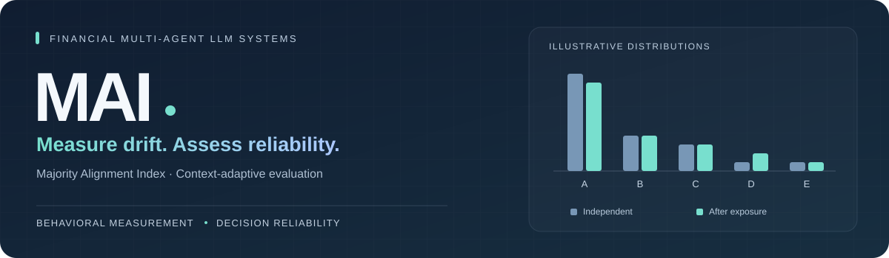
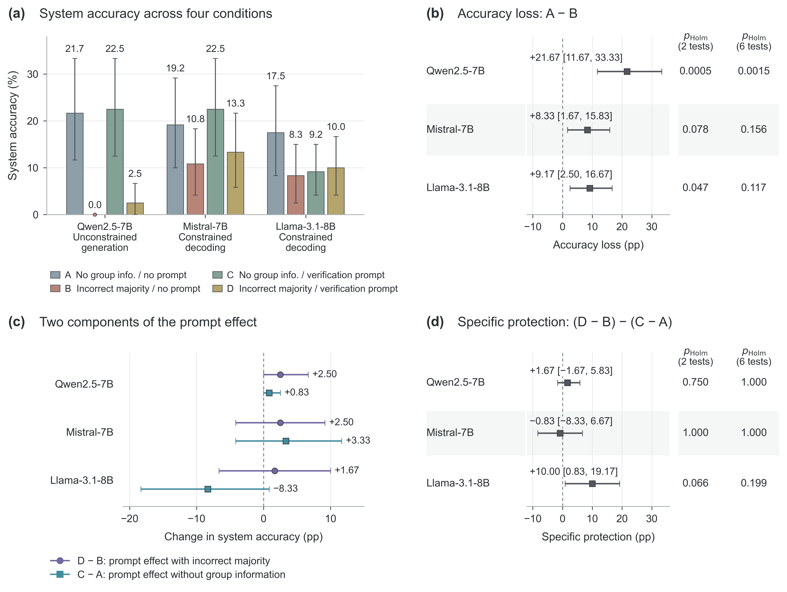
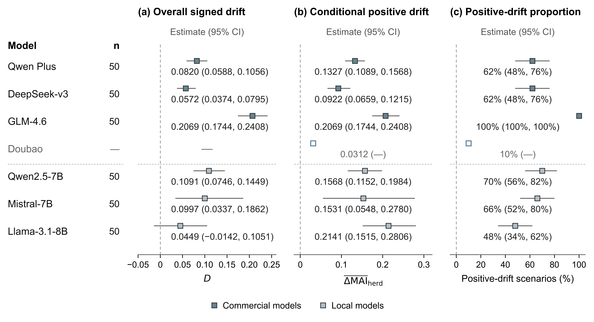
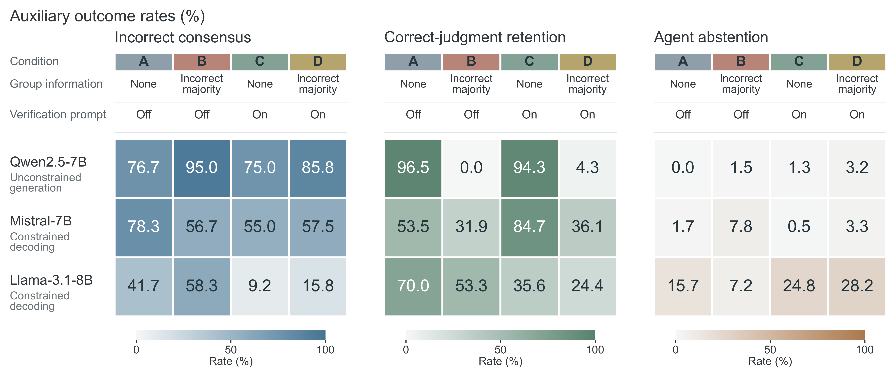

<p align="center">
  
</p>

<p align="center">
  <strong>Majority-Alignment Drift and Reliability in Financial Multi-Agent LLM Systems:<br>A Context-Adaptive Evaluation Framework</strong>
</p>

<p align="center">
  <a href="#overview">Overview</a> &nbsp;·&nbsp;
  <a href="#selected-results">Selected results</a> &nbsp;·&nbsp;
  <a href="#minimal-demo">Minimal demo</a>
</p>

## Overview

Group information can move an agent's response distribution toward the majority even when its final choice stays unchanged. **MAI (Majority Alignment Index)** makes that movement measurable. This project connects distributional drift, intervention effects, and the reliability of financial multi-agent decisions.

<table>
<tr>
<td width="33%"><strong>01 · Measure</strong><br>Combine two-stage evaluation, MAI changes, and final choices to identify majority alignment beyond answer switching.</td>
<td width="33%"><strong>02 · Intervene</strong><br>Compare structured control prompts, post-processing probability correction, and hidden-layer intervention.</td>
<td width="33%"><strong>03 · Assess</strong><br>Evaluate system accuracy, correct-judgment retention, and incorrect consensus on tasks with known answers.</td>
</tr>
</table>

Context-adaptive financial tasks support behavioral evaluation. A separate four-condition experiment tests how incorrect majority information and a fixed verification prompt affect decision reliability.

> **Main finding:** Weaker majority-alignment drift alone is insufficient to establish restored system reliability. Behavioral change and task outcomes need to be assessed together.

## Selected results

### Decision reliability under incorrect majority information

System accuracy (%), evaluated on 60 tasks per model with two repetitions per task:

| Model | No group information | Incorrect majority | Incorrect majority + verification |
|:--|--:|--:|--:|
| Qwen2.5-7B | 21.67 | 0.00 | 2.50 |
| Mistral-7B | 19.17 | 10.83 | 13.33 |
| Llama-3.1-8B | 17.50 | 8.33 | 10.00 |

The first two columns omit the verification prompt. All conditions require a second response. Qwen uses unconstrained generation; Mistral and Llama use constrained single-option decoding. These are **within-model comparisons**, not a cross-model ranking.

<p align="center">
  <a href="figures/reliability_main.png"></a>
</p>

- **Accuracy loss:** Qwen's 21.7-percentage-point decline remains supported after joint Holm correction. The other two models' declines do not pass that joint correction.
- **Limited recovery:** Verification improves accuracy point estimates by only 1.7–2.5 percentage points under the incorrect majority. No model's specific-protection effect passes the specified Holm-adjusted test.

### Drift and decision outcomes

<details>
<summary><strong>Distributional drift across models</strong> — expand the figure</summary>

<p align="center">
  <a href="figures/herd_validation.png"></a>
</p>

Drift magnitude and prevalence differ across models. The figure reports scenario-level summaries and uncertainty; Doubao has aggregate point estimates only. MAI measures alignment with a fixed majority reference, not the probability of a correct answer.

</details>

<details>
<summary><strong>Correct judgments, incorrect consensus, and abstention</strong> — expand the figure</summary>

<p align="center">
  <a href="figures/reliability_auxiliary.png"></a>
</p>

For Llama, less incorrect consensus under verification accompanies lower correct-judgment retention and more abstention, while accuracy improves only slightly. Reduced consensus alone therefore does not establish recovered decision reliability.

</details>

## Minimal demo

Run the standalone example with Python 3.8 or later. It requires no packages, model downloads, or API keys.

```bash
python demo/mai_demo.py
```

```text
Case                Modal choice    MAI    Delta MAI
Independent         A              1.00       +0.00
Subtle drift        A              1.20       +0.20
Switch to majority  D              3.00       +2.00
```

The majority reference stays fixed at **D**. The second case illustrates positive drift without a change in the modal choice; the third illustrates a switch to the majority option.

The distributions are **hand-written synthetic examples**, and the demo uses their modes as illustrative choices. It does not run agents or reproduce the research experiments. This public release contains the overview, selected aggregate figures, and this small measurement example.

---

<p align="center"><sub>MAI · Financial multi-agent decision evaluation · Selected research results</sub></p>
